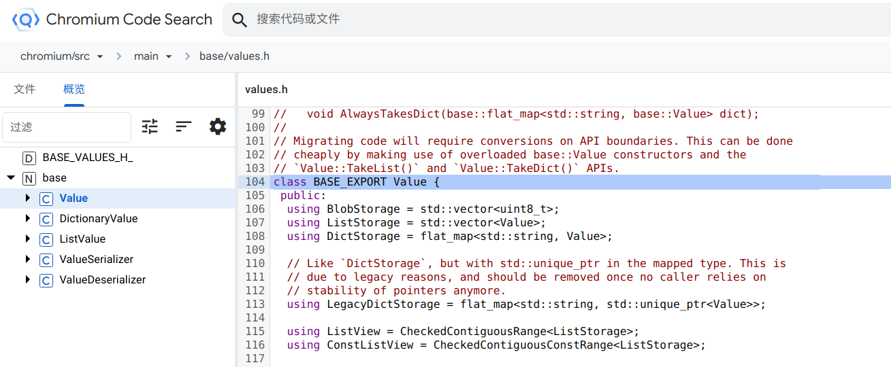
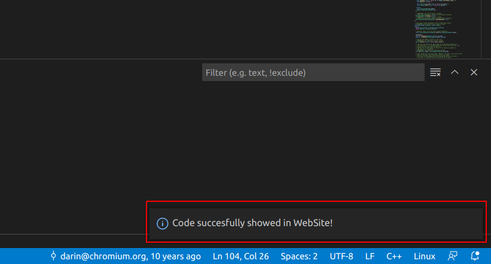

# CSO(Chromium Source Opener)

Link your local chromium code path to remote [source.chromium.org](https://source.chromium.org).

## Installation

You can install this extension from the [Visual Studio Marketplace](https://marketplace.visualstudio.com/items?itemName=FangzhenSong.chromium-source-opener).

*Tips: to enable the ability to link remote
[source.chromium.org](https://source.chromium.org) code path to your local chromium src, you should also install related
[Chrome Extension](https://chrome.google.com/webstore/detail/chromium-open-ide/oodolphplfmnljcohclgdikkoljjambi)/[MSEdge Extension](https://microsoftedge.microsoft.com/addons/detail/chromium-open-ide/ggfoollpnfolfaejalpiihpobcpbegkl).*

## Usage

Right-click on the line you want to visit on remote [source.chromium.org](https://source.chromium.org).

For example in `//base/values.h:104`

Then the same line will be opened in the browser on remote [source.chromium.org](https://source.chromium.org).

And one tip message will show on the right-bottom of your VsCode Browser if the open operation is executed successfully.

(No need to worry about, it will disappear in several seconds or you can close it manually. :))

**Enjoy!**
